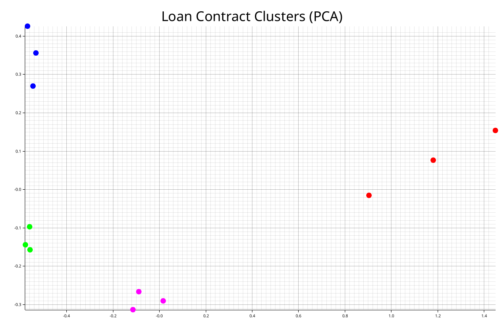

# Clustering Visual POC

## Inputs
* [data](https://github.com/gabrielSpassos/ai-sandbox/blob/main/clustering-visual-poc/src/data.rs)

## Output
* 

### Usage

* cargo clean
* cargo build
* cargo run