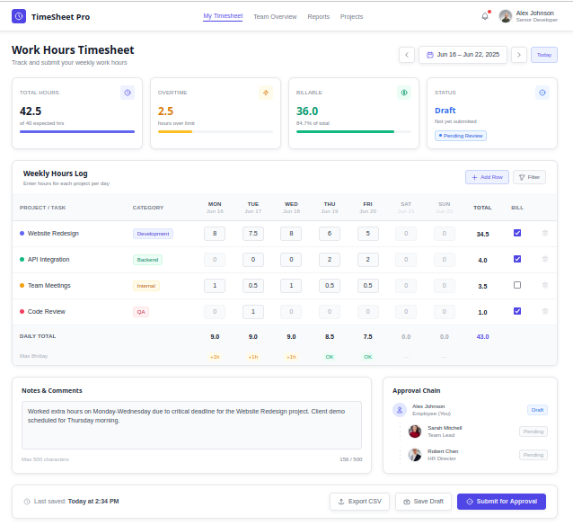

# UXMagic AI

> https://uxmagic.ai/

## Prompt

```
Create UI for timesheet work hours control
```

## Output

```
The user wants a timesheet work hours control UI. This should be a comprehensive time tracking dashboard with features like a weekly timesheet grid where users can log hours per project/task, daily hour totals, project breakdown, status indicators, and controls to submit/approve timesheets. I'll design a clean, modern interface with a weekly view showing days as columns and projects as rows, plus summary cards showing total hours, overtime, and remaining hours. I'll include navigation, a calendar week selector, and action buttons for saving and submitting.
Designed

I've created a comprehensive Timesheet Work Hours Control dashboard with a weekly grid for logging hours per project, daily totals, overtime indicators, summary cards, and an approval chain workflow. The design includes interactive features like adding/removing rows, editable hour inputs with live totals, a submit confirmation modal, and export options. Would you like me to add a monthly overview chart, or adjust the layout to include a team manager approval view?
```


